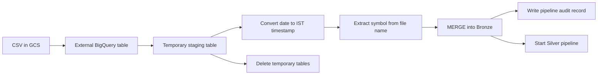

# Bronze Layer Architecture

## Purpose

The Bronze layer is the first durable BigQuery layer. It loads normalized market rows from CSV files stored in Google Cloud Storage (GCS).

Bronze preserves the core market values while standardizing timestamps and stock symbols. It does not calculate trading indicators.

## Inputs

Historical files are read from a monthly GCS pattern:

```text
gs://<bucket>/<year>/<MonthName>/*.csv
```

Incremental processing reads one uploaded file:

```text
gs://<bucket>/<path>/<file>.csv
```

Expected CSV columns:

```text
date, open, high, low, close, volume
```

## BigQuery Objects

Default configuration:

```text
Project: project-001658fa-3ce5-4746-980
Dataset: bronze_data
Table: intraday_master
Audit dataset: audit_dataset_us
Audit table: pipeline_audit
```

Bronze table columns:

```text
timestamp TIMESTAMP NOT NULL
open FLOAT64
high FLOAT64
low FLOAT64
close FLOAT64
volume FLOAT64
symbol STRING NOT NULL
```

The Bronze table is partitioned by `timestamp` and clustered by `symbol, timestamp`.

## Processing Flow



## Historical Path

`process_historical_month(year, month)`:

1. Ensures the audit and Bronze tables exist.
2. Builds a unique batch ID.
3. Points an external table at all CSV files for the selected month.
4. Creates a staging table with typed timestamps and normalized symbols.
5. Counts staged rows.
6. Merges rows into Bronze using `symbol + timestamp` as the logical business key.
7. Writes `SUCCESS` or `FAILED` to the audit table.
8. Deletes the external and staging tables.
9. Starts Silver processing when configured.

## Incremental Path

`process_new_file(file_path)` follows the same pattern for one new file. It also identifies the affected symbol and timestamp range so Silver can use an incremental scope and lookback history.

## Idempotency

The Bronze `MERGE` matches on:

```text
T.symbol = S.symbol
AND T.timestamp = S.timestamp
```

Existing rows are updated and new rows are inserted. Reprocessing the same file does not intentionally create a second row for the same logical key.

## Audit Responsibility

The audit table records operational metadata:

```text
batch_id
pipeline_type
process_date
year
month
file_name
status
rows_processed
message
```

The audit table records what happened. It does not replace the external table, which defines how BigQuery reads the GCS CSV files.

## Cost and Performance

- GCS is the raw file source.
- External and staging tables are temporary processing objects.
- Partitioning reduces date-based scans.
- Clustering improves symbol and timestamp filtering.
- Incremental scope avoids processing every symbol for every run.
