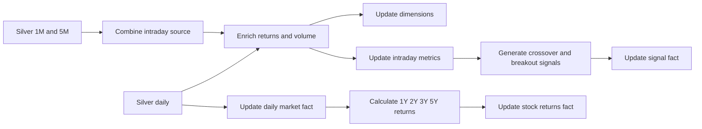

# Gold Layer Architecture

## Purpose

The Gold layer is the business and trading-ready dimensional layer. It converts trusted Silver data into facts, dimensions, business classifications, deterministic trading signals, and multi-year return snapshots.

## Schema Pattern

The complete Gold dataset is a **galaxy schema**, also called a **fact constellation schema**:

- Multiple fact tables exist.
- The fact tables share conformed dimensions.
- Each individual fact table has a star-schema relationship to the dimensions.
- The model is intentionally denormalized for analytical queries.

## BigQuery Objects

Default dataset:

```text
project-001658fa-3ce5-4746-980.pulse_trade_gold
```

Dimensions:

```text
dim_stock
dim_date
dim_timeframe
```

Facts:

```text
fact_intraday_metrics
fact_intraday_signals
fact_daily_market
fact_stock_returns
```

## Logical Relationships

The schema does not declare enforced BigQuery foreign-key constraints. The relationships are logical:

```text
fact_intraday_metrics.stock_key  -> dim_stock.stock_key
fact_intraday_metrics.date_key   -> dim_date.date_key
fact_intraday_metrics.timeframe_key -> dim_timeframe.timeframe_key

fact_intraday_signals.stock_key   -> dim_stock.stock_key
fact_intraday_signals.date_key    -> dim_date.date_key
fact_intraday_signals.timeframe_key -> dim_timeframe.timeframe_key

fact_daily_market.stock_key       -> dim_stock.stock_key
fact_daily_market.date_key        -> dim_date.date_key
fact_stock_returns.stock_key      -> dim_stock.stock_key
```

Facts also retain useful descriptive values such as `symbol`, `trade_date`, and `timeframe` to keep analytical queries simple.

## Processing Flow



## Business Fields

Gold derives fields such as:

```text
price_vs_vwap
price_vs_ema20
price_vs_sma20
volume_status
trend
momentum_score
```

The momentum score combines six boolean conditions involving VWAP, EMA, RSI, MACD, and relative volume.

## Signal Types

`fact_intraday_signals` stores deterministic events such as:

```text
DAY_HIGH_BREAKOUT
DAY_LOW_BREAKDOWN
VWAP_CROSS_UP
VWAP_CROSS_DOWN
EMA_BULLISH_CROSSOVER
EMA_BEARISH_CROSSOVER
MACD_BULLISH_CROSSOVER
MACD_BEARISH_CROSSOVER
VOLUME_BREAKOUT
```

A deterministic `signal_id` is generated from symbol, timestamp, timeframe, and signal type.

## Incremental Processing

Gold receives the affected symbol and date range from Silver. The SQL templates inject filters so Gold recalculates only the relevant Silver range and updates affected Gold rows through `MERGE` statements.

## Persistence and Idempotency

- Dimensions add missing stock, date, and timeframe members.
- Fact tables update existing logical keys and insert new rows.
- Signal rows use deterministic IDs to prevent duplicate signal events.
- Gold reads Silver and writes Gold; it does not modify Silver.

## Optional AI Serving Branch

The current `gold.py` also creates and refreshes three AI snapshot tables in `pulse_trade_ai`:

```text
ai_current_intraday_snapshot
ai_current_signal_snapshot
ai_latest_daily_snapshot
```

The current agent and semantic SQL read `pulse_trade_ai_semantic` and Gold objects directly, not these snapshot tables. Treat the AI snapshot branch as a separately governed serving path and verify external consumers before removing it.
