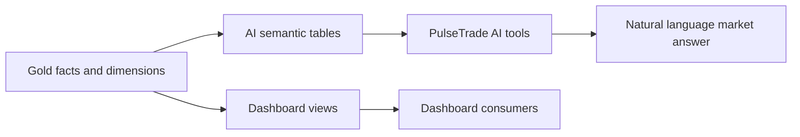

# Semantic Layer Architecture

## Purpose

The Semantic layer exposes Gold data in stable, business-oriented shapes for dashboards and the PulseTrade AI agent. It hides physical Gold-table details and gives consumers named views or curated tables.

## Datasets

Default datasets:

```text
AI semantic dataset: pulse_trade_ai_semantic
Dashboard dataset: pulse_trade_semantic_v2
Semantic dataset: pulse_trade_semantic
```

The current transformation SQL creates curated AI semantic tables in `pulse_trade_ai_semantic` and dashboard views in `pulse_trade_semantic_v2`.

## AI Semantic Tables

The current AI semantic SQL creates:

```text
spot_ai_current_market_state
spot_ai_signal_history_90d
spot_ai_intraday_history_90d
spot_ai_daily_history
spot_ai_intraday_behavior
spot_ai_stock_summary
```

These are built from Gold facts and dimensions. They provide current market state, signal history, intraday history, daily history, behavior summaries, and stock summaries.

## Dashboard Views

The dashboard SQL exposes views such as:

```text
vw_market_overview
vw_symbol_intraday_chart
vw_signal_scanner
```

The repository also contains additional semantic objects documented for the agent, including scanner, breakout, gainers, losers, returns, stock metrics, and market overview views.

## Processing Flow



## Consumer Contract

The AI agent is intended to query approved semantic objects rather than raw Bronze or Silver tables. This keeps the agent focused on curated business metrics and helps control query cost and access.

Typical semantic questions include:

- RSI below or above a threshold.
- Price above VWAP.
- Bullish MACD crossover.
- Stock comparison.
- Market overview.
- Ranking and scanner questions.

## Security Boundary

The semantic layer is the controlled read surface for the agent. The agent should not receive unrestricted access to Bronze, Silver, or arbitrary BigQuery tables.

## Important Runtime Note

`gold.py` currently calls `ensure_semantic_views()` after Gold and AI-serving work. The semantic SQL reads Gold directly. The AI snapshot tables in `pulse_trade_ai` are a separate branch and are not referenced by the current semantic SQL or agent tool queries found in this repository.

## Cost Controls

- Prefer partition filters on `trade_date`.
- Query only approved semantic objects.
- Use limits for scanner and ranking results.
- Avoid diagnostic `COUNT(*)` queries over large tables during normal runs.
- Keep semantic objects narrow and business-oriented.
