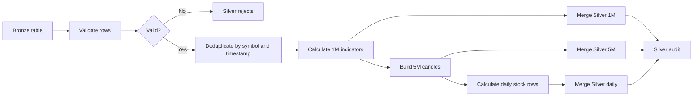

# Silver Layer Architecture

## Purpose

The Silver layer is the trusted analytics layer. It validates Bronze rows, records rejected rows, removes duplicate business records, and calculates reusable technical indicators.

Silver is the first layer where the data is treated as trusted for downstream analytics.

## BigQuery Objects

Default dataset:

```text
project-001658fa-3ce5-4746-980.silver_dataset_us
```

Tables:

```text
silver_intraday_1m
silver_intraday_5m
silver_daily_stock
silver_rejects
silver_audit
```

The 1-minute and 5-minute tables are partitioned by `trade_date` and clustered by `symbol, timestamp`. The daily table is partitioned by `trade_date` and clustered by `symbol`.

## Validation Rules

Rows are rejected when:

- Required values are null.
- OHLC values are non-positive.
- Volume is negative.
- High is below low.
- Open or close is outside the low-to-high range.
- The timestamp is outside 09:15 to 15:30 India time.

Rejected rows are written to `silver_rejects` with a reason and rejection timestamp.

## Transformations

Silver calculates or stores:

```text
previous_close
return_pct
gap_pct
sma_20
ema_9
ema_20
rsi_14
macd
macd_signal
vwap
avg_volume_20
relative_volume
```

It also creates:

- 5-minute candles from trusted 1-minute data.
- Daily stock rows from trusted intraday data.
- A run audit record with read, processed, inserted, rejected, and duplicate counts.

The project documentation notes that several indicator formulas are fast rolling-window approximations rather than recursive textbook EMA/RSI/MACD implementations.

## Processing Flow



## Incremental Processing

For a new file containing one symbol and a known time range, Bronze passes a scope to Silver:

```text
symbol
scope_start
scope_end
```

Silver reads additional historical rows before `scope_start` so rolling indicators have enough context. It writes only the affected range to the Silver outputs.

This separates:

```text
Calculation input: affected range plus lookback history
Output range: affected range only
```

## Idempotency

Silver compares incoming Bronze rows with existing Silver rows. It updates changed rows and avoids reinserting unchanged rows. Invalid rows are deduplicated in `silver_rejects` using their logical values and rejection reason.

## Audit and Monitoring

`silver_audit` is part of the data pipeline because it records run outcomes. Python functions that print summaries or the latest audit row are monitoring helpers and can be disabled without changing the transformation result.

## Downstream Contract

Gold reads trusted Silver tables. Silver does not create final trading signals; Gold derives business classifications and deterministic signal events.
